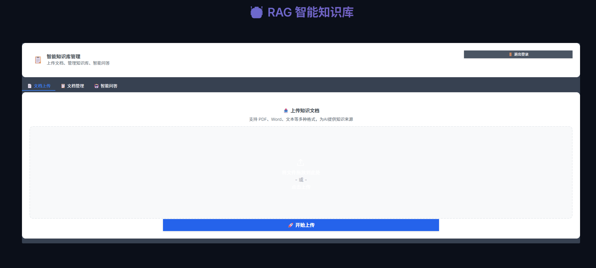
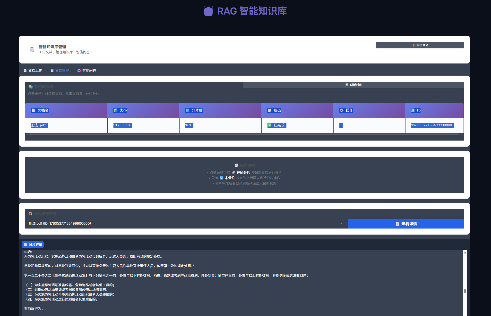
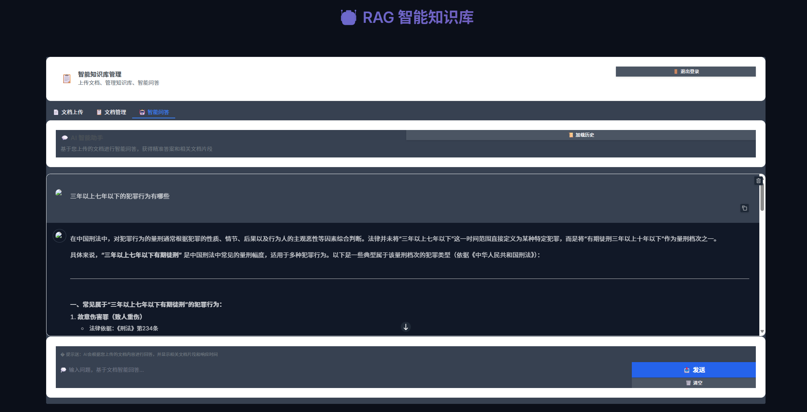
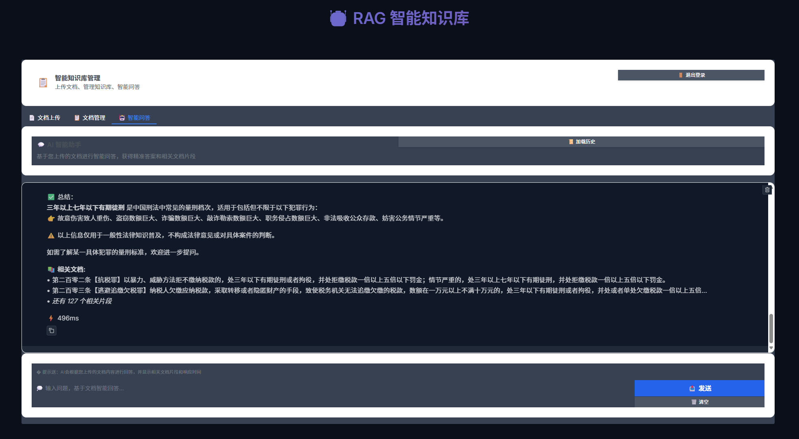
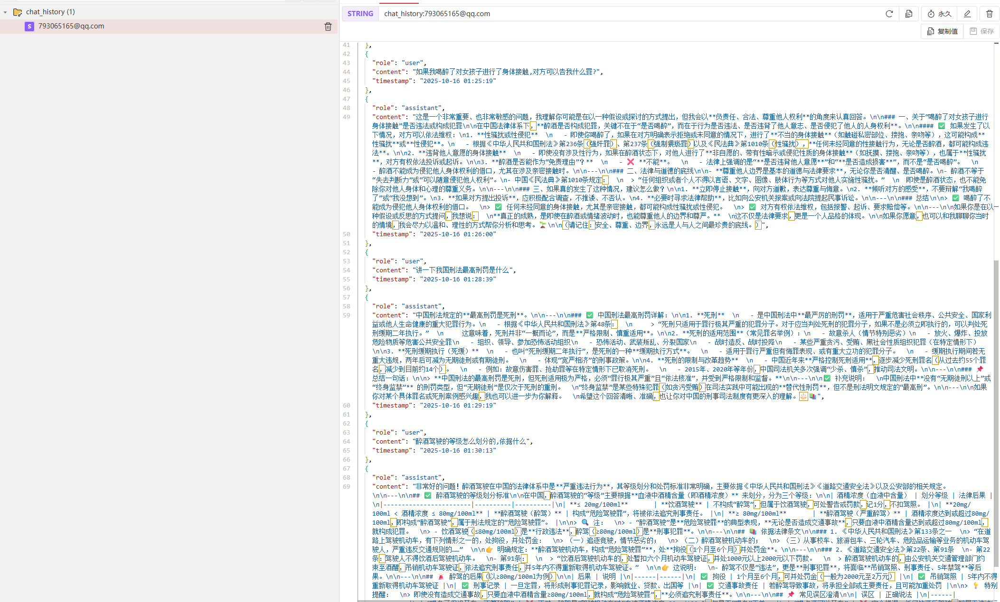

# 个人学习rag技术demo 
es-混合 全文索引+向量索引  
redis-keyval 历史记录  
mysql 基础字段支持  
minio 文件存储  
显卡: NVIDIA GeForce RTX 4060ti 16g  
本地模型:  Qwen3-4B-Instruct-2507 --可根据配置自行下载使用其他小模型  
文本嵌入:  bge-small-zh-v1.5  
pdf解析:  mineru  

## 示例
  
  
  
  
  

# 环境部署 bash
`conda create -n ragdemo python==3.12 -y`  
`pip install torch==2.7.1+cu126  torchaudio==2.7.1+cu126 torchvision==0.22.1+cu126 -f  https://mirrors.aliyun.com/pytorch-wheels/cu126`  
`pip install pymysql==1.1.1 pydantic==2.11.7 PyYAML==6.0.2 Requests==2.32.5 SQLAlchemy==1.4.54 loguru==0.7.3 -i https://mirrors.aliyun.com/pypi/simple`  
`pip install dataset==1.6.2 redis==6.4.0 minio==7.2.4 elasticsearch==8.11.0 -i https://mirrors.aliyun.com/pypi/simple`  
`pip install fastapi uvicorn[standard] -i  https://pypi.tuna.tsinghua.edu.cn/simple`  
`pip install langchain==0.3.27 -i  https://pypi.tuna.tsinghua.edu.cn/simple`  
`pip install numpy==2.3.2 sentence_transformers==5.1.0 transformers==4.56.0 -i  https://pypi.tuna.tsinghua.edu.cn/simple`  
`pip install gradio==5.44.1 huggingface_hub==0.34.4 -i https://mirrors.aliyun.com/pypi/simple`  
`pip install -U hf-transfer -i https://pypi.tuna.tsinghua.edu.cn/simple`  
`pip install huggingface_hub[hf_xet] -i https://pypi.tuna.tsinghua.edu.cn/simple`  
`pip install --upgrade pip -i https://mirrors.aliyun.com/pypi/simple`  
`pip install uv -i https://mirrors.aliyun.com/pypi/simple`  
`uv pip install -U "mineru[core]" -i https://mirrors.aliyun.com/pypi/simple`  

# 模型下载
`cd ser/models && python download_model`  

# 启动基础服务
`cd docker`  
`docker compose -f docker-compose-base.yml up -d`

